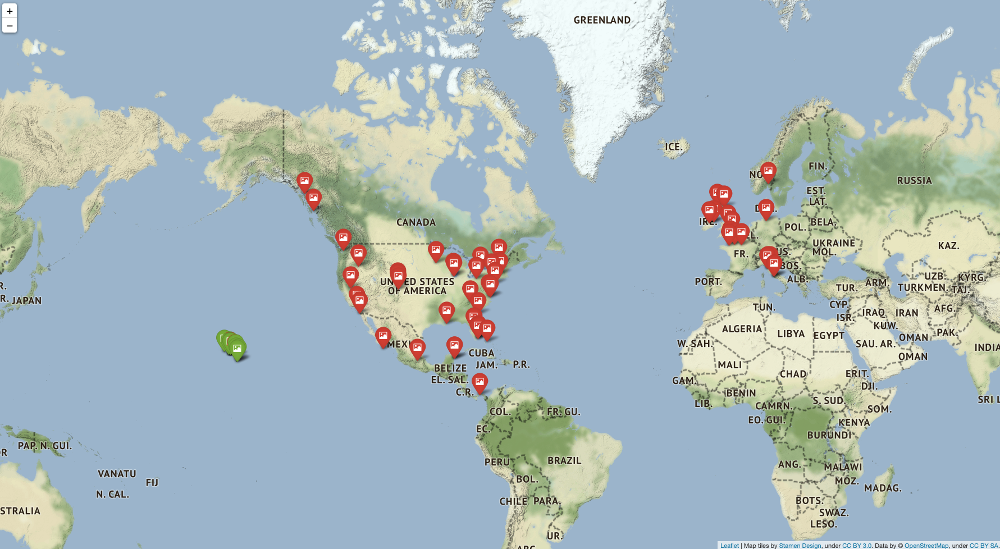

The script [`make_Multi_image_sources.py`](./make_Multi_image_sources.py) is used to make the map [`Multi_image_sources.html`.](./Multi_image_sources.html)  This map takes in two input `*.csv` files and plots each file with different colored pins.

