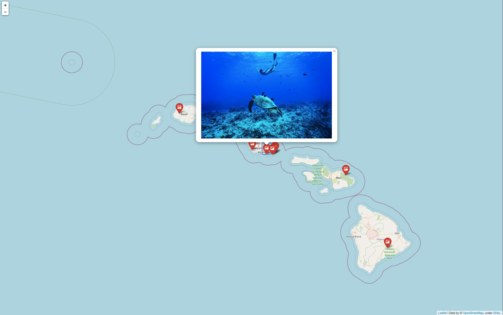

# World Map of Photos 

Generate a map with pins that identify locations you have visited.  Clicking a pin causes an image, taken at the location, to pop-up.

----
### Photos Taken Around the World
This project uses python to add images taken around the world to a photo map.  The final map is an HTML page that uses markers to indicate locations where images were taken.  Clicking on each marker causes the associated image to popup.

A simple example is shown in [`simple_map/`](./simple_map/).  This example only plots one photo on a map.

A more complex example is shown by [`main_map/`](./main_map/).  This method assumes there is no EFIX data attached to each image, so image names and coordinates are stored in a `*.csv` file.

The directory [`geotag_EFIX/`](./geotag_EFIX/) is used to extract location data from a photos EFIX.  This data is used to automatically plot photos, without the need for a `*.csv` file.

The script [`make_HI_photo_map.py`](./HI_photo_map/make_HI_photo_map.py) in [`HI_photo_map`](./HI_photo_map/) was used to generate the html map, [`HI_photo_map.html`](./HI_photo_map/HI_photo_map.html).  The map starts over the Hawaiian Island Archipelago.


One an icon is clicked, a photo taken at that location popsup.



[`Mutnik5`](./Mutnik5/) uses separate csv files.  Each file contains information for specific image sets.  In this case, each csv contains images taken by different people.  Each set of images is added to the map, with different pin/icon colors used to distinguish them.  [`Mutnik_photo_map.html`](./Mutnik5/Mutnik_photo_map.html) uses green pins to show images taken by one family member and red pins to show images taken by another family member.  Copies of said images have intentionally been removed from this repository, to conserve space.


----
----
### Terrain Options
In folium, the `tiles` parameter determines the type of map used.
```py
m = folium.Map([42.3730,-73.3677], zoom_start=3, tiles='Stamen Terrain')
```
Other options for `tiles` include:
    - `tiles='cartodbpositron'`,
    - `'OpenStreetMap'`
    - `'Stamen Terrain'`, `'Stamen Toner'`, `'Stamen Watercolor'`
    - `'CartoDB positron'`, `'CartoDB dark_matter'`
    - `'Mapbox Bright'`, `'Mapbox Control Room'` (Limited zoom)
    - `'Cloudmade'` (Must pass API key)
    - `'Mapbox'` (Must pass API key)


----
### Icon Modifications
`folium` has various marker options.  A full list of icon options can be found on Front Awesome, [here.](https://fontawesome.com/v4.7.0/icons/)<br>
This project uses red icons with a picture symbol in them:
```py
[folium.Marker(
location=imgcoords[j],
popup=folium.Popup(testNOloop[j], max_width=imgsize),
icon=folium.Icon(color='red', icon='picture')
).add_to(m)  for j in range(len(imgcoords))]
```
If you wanted to add red markers with a different symbol in them, you can change the `icon` setting:
```py
[folium.Marker(
location=imgcoords[j],
popup=folium.Popup(testNOloop[j], max_width=imgsize),
icon=folium.Icon(color='red', icon='info-sign')
).add_to(m)  for j in range(len(imgcoords))]
```
Here is another method to add markers (with default color and symbol):
```py
# use standard blue marker, with popup
popup1 = [folium.Popup(testNOloop[i], max_width=imgsize) for i in range(len(testNOloop))]
[folium.Marker(location=imgcoords[j], popup=popup1[j],).add_to(m) for j in range(len(imgcoords))]
```
To add a marker, without a popup:
```py
# add marker (no popup)
[folium.Marker(imgcoords[i]).add_to(m) for i in range(len(imgcoords))] 
```
